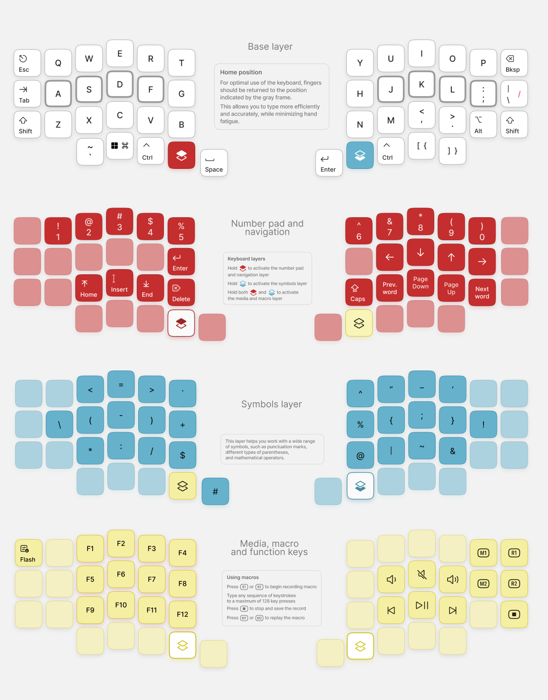
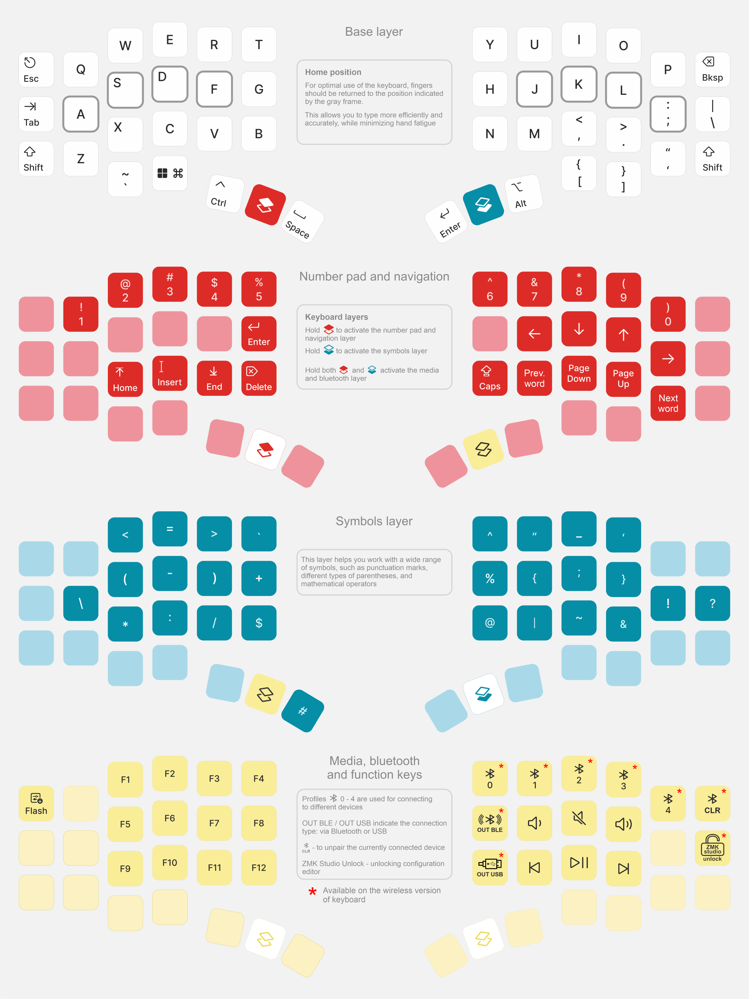

## Velvet v3 is a curved, compact mechanical keyboard with a 40% layout size  
*Minimalist, compact, elegant - there is nothing superfluous in it, only the necessary set of elements to know yourself and the harmony of your own world... A wireless version is also available: [Velvet v3 – Wireless Edition](https://eh.works/shop/tproduct/767494027-641661295972-velvet-v3-wireless-edition)*

## Design philosophy
This keyboard [was made](https://www.youtube.com/watch?v=800tXbrIh_E) with FDM printing in mind, the goal was to make a perfect curved case that can be easily printed and looks aesthetically pleasing with minimal amount of so called "steps" that plague similar 3D keyboards like Dactyl Manuform. This is mostly inspired by the Cygnus, Smudge and Chonky Bois keyboards, we wanted to make a similar "organic" shaped keyboard but much more optimized for FDM printing, easy assembly and looking good not only on a photo but also in real life 😎

## Features

- Ergonomic 3D design
- 46 fully programmable keys, 15 additional layers for all your tasks
- Hot-swappable PCB

### Velvet v3
- Powered by RP2040 and QMK firmware
- USB-C connection between halves
- Easily remap any key and customize your keyboard with [Vial](https://eh.industries/vial)

### Velvet v3 – Wireless Edition
- Powered by nRF52840 and RMK/ZMK firmware
- Bluetooth connectivity for up to 6 devices
- Rechargeable 200 mAh battery
- USB-C connection

## This repo contains all files related to this keyboard
PCB and schematic for [Velvet v3](https://oshwlab.com/yuriiq/velvet_v3) and [Velvet v3 - Wireless Edition](https://oshwlab.com/yuriiq/project_hosoggvz)

### Build guide (PCB is required)
- [English](https://github.com/ergohaven/velvet/blob/main/build_guide/build_guide_en.md)
- [Russian](https://github.com/ergohaven/velvet/blob/main/build_guide/build_guide_ru.md)

### BOM

#### Velvet v3

| Components | Quantity (pcs) |
| --- | ---: |
| Velvet v3 Switchplate + MCU holder PCBs | 1 |
| RP2040 Zero MCU | 2 |
| MX Hotswap sockets | 46 |
| 1N4148W Diodes (SOD-123) | 46 |
| Male Pin Header Connector: 11 Pins, 2.54mm, 90 degree | 2 |
| Female Header Sockets: 11 Pins, 2.54mm, 90 degree | 2 |
| 10kOhm resistors (0805) | 4 |
| USB Type-C daughterboard: 1.6mm thick | 1 |
| M2x4 Screws | 30 |
| M3x4 Inserts | 10 |
| M3x4 Screws | 10 |

#### Velvet v3 – Wireless Edition

| Components | Quantity (pcs) |
| --- | ---: |
| Velvet v3 WE Switchplate + MCU holder PCBs | 1 |
| E73-2G4M08S1C Bluetooth module | 2 |
| MX Hotswap sockets | 46 |
| 1N4148WT diodes, SOD-523F | 46 |
| Male Pin Header Connector: 11 Pins, 2.54mm, 90 degree | 2 |
| Female Header Sockets: 11 Pins, 2.54mm, 90 degree | 2 |
| ZX-SH1.0-4PWT SMD wire-to-board connector | 4 |
| SH 1.0mm Female Socket Plug Wire, 4pin, double connector, 10 mm | 2 |
| Capacitor 0402 4.7 µF | 4 |
| Capacitor 0402 10 µF | 2 |
| B5819WS Schottky diode, SOD-323 | 2 |
| Resistor 0402 5.1 kΩ | 4 |
| Resistor 0402 100 kΩ | 2 |
| Resistor 0402 806 kΩ | 2 |
| Resistor 0402 2 MΩ | 2 |
| Resistor 0402 10 kΩ | 2 |
| ZX-SH1.0-2PWT SMD wire-to-board connector | 2 |
| TS5235A 250gf 025 SMD tactile switch | 2 |
| SMD USB connector USB-TYPE-C-018 | 2 |
| P-channel MOSFET, SOT-23-3, SI2301-A1SHB | 2 |
| TP4057 linear Li-Ion battery charger, SOT-23-6 | 2 |
| MSK12CO2-SZ SMD slide switch | 2 |
| AP2112K-3.3TRG1 LDO regulator, SOT-23-5 | 2 |
| Li-Pol, 3.7V, 200mAh, 402035, with JST SH-1.0mm, 2 pin connector | 2 |
| M2x4 Screws | 30 |
| M3x4 Inserts | 10 |
| M3x4 Screws | 10 |
| 3M bumpons (8 mm) | 8 |
| MagSafe ring (optional) | 2 |

## License 

The files in this repository are licensed under a Creative Commons Attribution-NonCommercial-ShareAlike 4.0 International License

## Useful links

- Velvet v3:
  - [Case for 3D printing (STL)](stls/velvet-v3)
  - [Case model for editing (STEP)](step/velvet-v3)
  - [Circuit schematic](https://oshwlab.com/yuriiq/velvet_v3)

- Velvet v3 – Wireless Edition:
  - [Case for 3D printing (STL)](stl/velvet-v3-we)
  - [Case model for editing (STEP)](step/velvet-v3-we)
  - [Circuit schematic](https://oshwlab.com/yuriiq/project_hosoggvz)

### Firmware
- [Pre-compiled files](https://github.com/ergohaven/keymap_hub)
- Source code:
  - wired [QMK](https://github.com/ergohaven/vial-qmk)
  - wireless [RMK](https://github.com/ergohaven/rmk-eh)
  - wireless [ZMK](https://github.com/ergohaven/ergohaven-zmk)

## Availability
The complete keyboard (not a DIY kit) is available for purchase at [eh.industries](https://eh.industries/)
